Build synthetic networks
================
Giulia Bertagnolli

## Full network topology (clique)

``` r
N <- 30
g <- make_full_graph(n = N)
m <- gsize(g)
```

We start creating the topology of the networks, a full network with 30
and 435 edges. Upon this naive topology we impose edge weights sampled
from two distributions:

  - Poisson with varying parameter
     for homogeneous weights,
  - power-law with varying parameter
    
    for heterogeneous weights.

We henceforth indicate by  the random variable representing the edge weight, i.e. the
intensity of an interaction.

### Homogeneous weights distribution

") with . With `rpois(m, lambda)` we take a
sample of size 435 from the Poisson distribution with parameter
`lambda`.

``` r
lambdas <- 1:12
```

``` r
weights_pois <- lapply(lambdas, function(lambda) {
  sapply(1:n, function(i) {
    1 + rpois(m, lambda)
  })
});
```

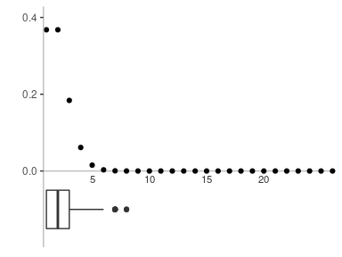<!-- -->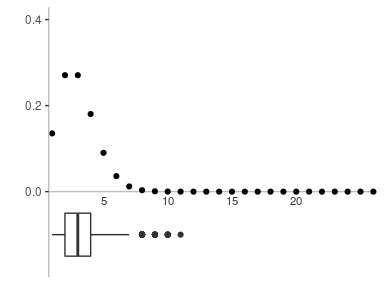<!-- -->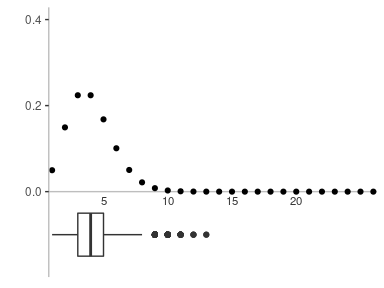<!-- -->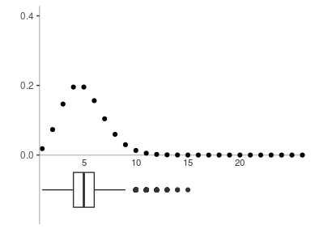<!-- -->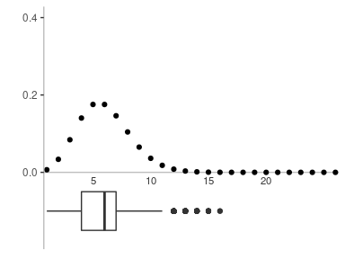<!-- -->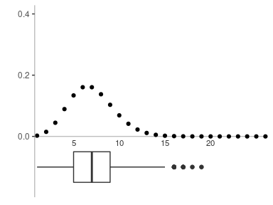<!-- -->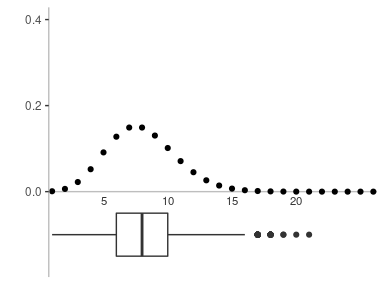<!-- --><!-- -->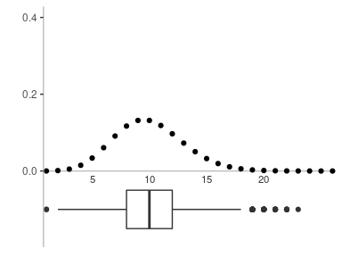<!-- -->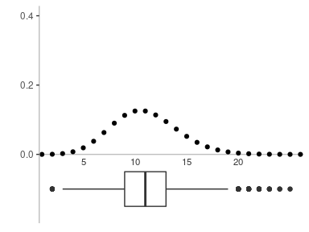<!-- -->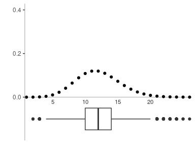<!-- -->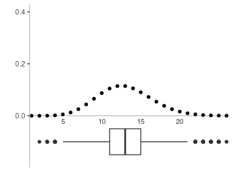<!-- -->

-----

### Heterogeneous weights distribution

") that is:   
 = \\frac{\\alpha-1}{w_{\\min }}\\left(\\frac{w}{w_{\\min }}\\right)^{-\\alpha}
")  
see Clauset, Shalizi, and Newman (2009) for a reference.

``` r
# power-law from uniformly randomly sampled (Clauset Appx.D)
rpower <- function(n, x_min, alpha) {
  r <- runif(m)
  x_min * (1 - r) ** (-1 / (alpha - 1))
}
dpower <- function(x, x_min, alpha) {
  (alpha - 1) / x_min * ((x / x_min) ^ -alpha)
}
# parameter space
x_min <- 5
alphas <- seq(1.5, 7, .5)
```

``` r
weights_pwl <- lapply(alphas, function(alpha) {
  sapply(1:n, function(i) {
    rpower(n, x_min, alpha)
  });
})
```

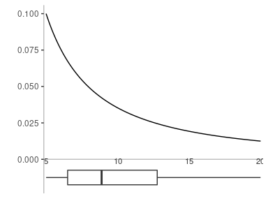<!-- -->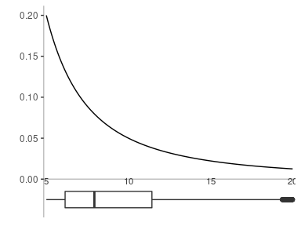<!-- -->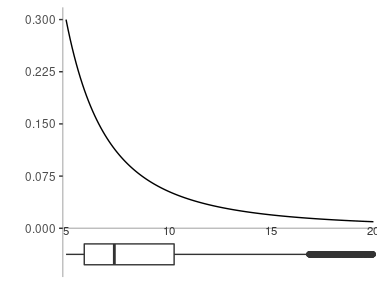<!-- -->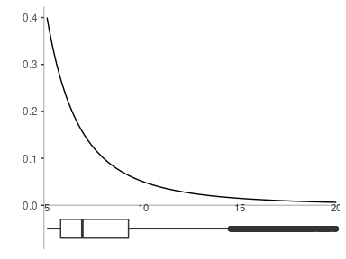<!-- -->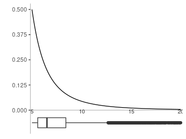<!-- -->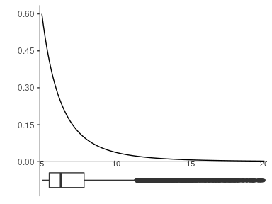<!-- -->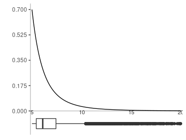<!-- --><!-- -->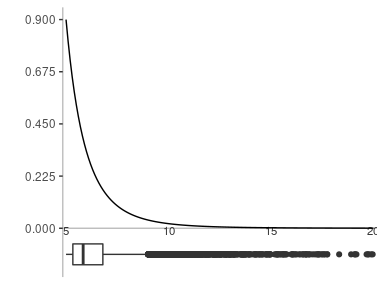<!-- -->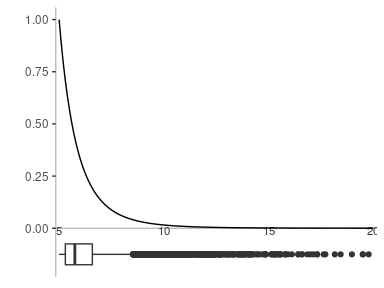<!-- -->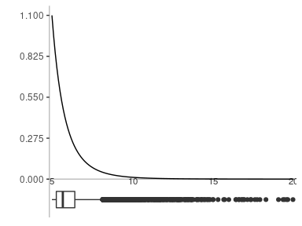<!-- -->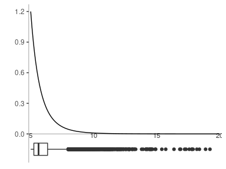<!-- -->

## Weighted networks from network models

The following code does **not** generate the same data as in our paper
Bertagnolli, Gallotti, and De Domenico (2020), which are available under
reasonable request. Here we provide some sample code, for obtaining
**one** realisation of each network model topology and then generate
their edge weights as in Bertagnolli, Gallotti, and De Domenico (2020).

The parameters used to generate the networks topology have been chosen
such that for  we get .

### Barabasi–Albert model with weights

``` r
N <- 256
g_BA <- sample_pa(n = N, m = 12 / 2, power = 1, directed = FALSE)
```

This network is unweighted and we add link weights following the rule   
  
for varying parameter
.

``` r
betas <- seq(-5, 5)
unitary_matrix <- matrix(1, N, N)
```

#### Generating links weights

``` r
degree_BA <- degree(g_BA)
```

``` r
weighted_adj_BA_list <- lapply(betas, function(beta) {
  degree_BA ^ beta * unitary_matrix * as_adjacency_matrix(g_BA)
})
```

Now, we have a list (where the index runs from 1 to 11 and represents
the `beta` parameter), where each element of the list is a weighted
adjacency matrix. Observe that the 11th element corresponds to  and to the unweighted case. Except for the case , the networks become **directed**, since the weighted
adjacency matrices are no more symmetric.

``` r
weighted_g_BA_list <- lapply(seq_along(betas), function(i) {
  W <- weighted_adj_BA_list[[i]]
  graph_from_adjacency_matrix(W, weighted = TRUE)
});
```

<!-- -->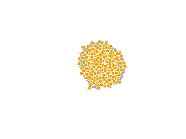<!-- -->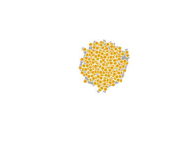<!-- -->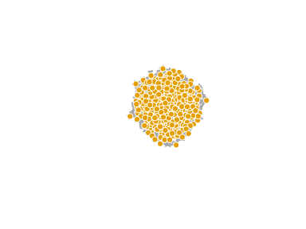<!-- -->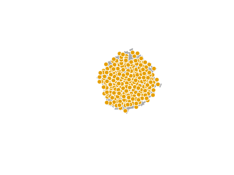<!-- -->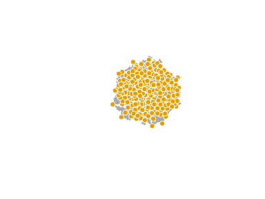<!-- -->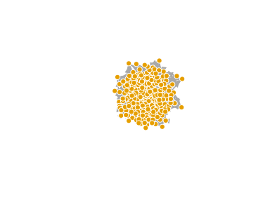<!-- -->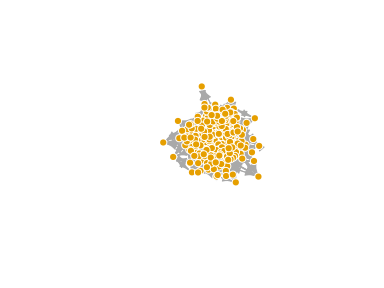<!-- -->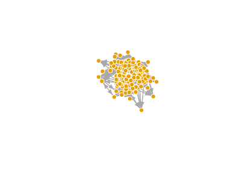<!-- -->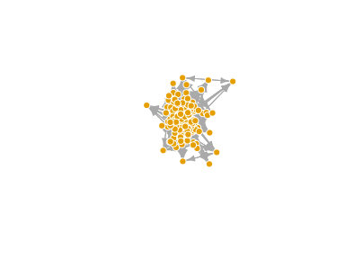<!-- -->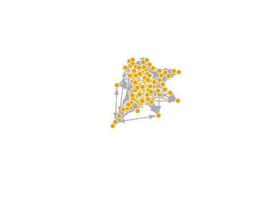<!-- -->

### Watts–Strogatz model with weights

We do the same for a WS model.

``` r
g_WS <- sample_smallworld(dim = 2, size = sqrt(N), nei = 2, p = 0.1,
                          multiple = F, loops = F)
```

#### Generating links weights

``` r
degree_WS <- degree(g_WS)
```

``` r
weighted_adj_WS_list <- lapply(betas, function(beta) {
  degree_WS ^ beta * unitary_matrix * as_adjacency_matrix(g_WS)
})
```

``` r
weighted_g_WS_list <- lapply(seq_along(betas), function(i) {
  W <- weighted_adj_WS_list[[i]]
  g <- graph_from_adjacency_matrix(W, weighted = TRUE)
  return(g)
});
```

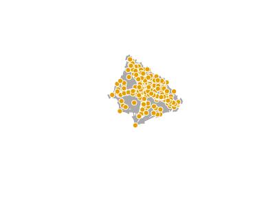<!-- -->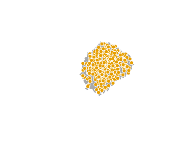<!-- -->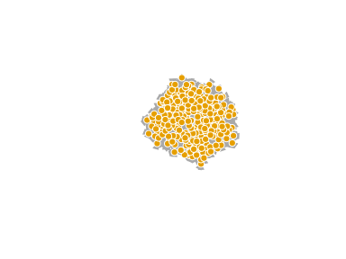<!-- -->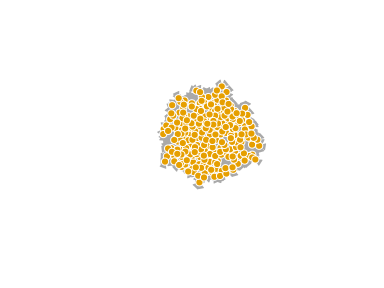<!-- -->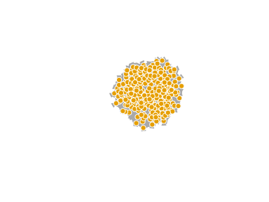<!-- -->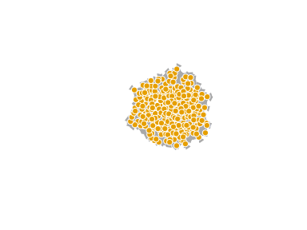<!-- -->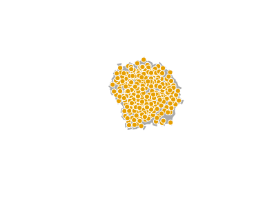<!-- -->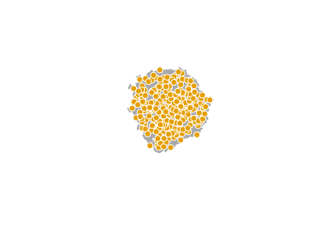<!-- --><!-- -->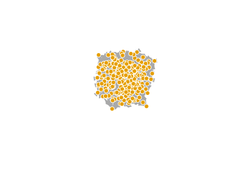<!-- -->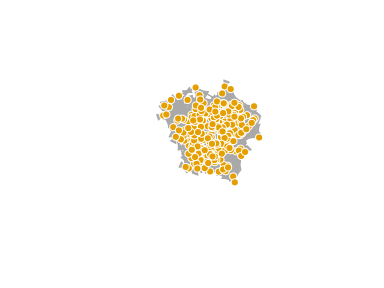<!-- -->

<div id="refs" class="references">

<div id="ref-bertagnolli2020quantifying">

Bertagnolli, Giulia, Riccardo Gallotti, and Manlio De Domenico. 2020.
“Quantifying Efficient Information Exchange in Real Network Flows.”
*arXiv Preprint arXiv:2003.11374*.

</div>

<div id="ref-clauset2009power">

Clauset, Aaron, Cosma Rohilla Shalizi, and Mark EJ Newman. 2009.
“Power-Law Distributions in Empirical Data.” *SIAM Review* 51 (4):
661–703.

</div>

</div>
